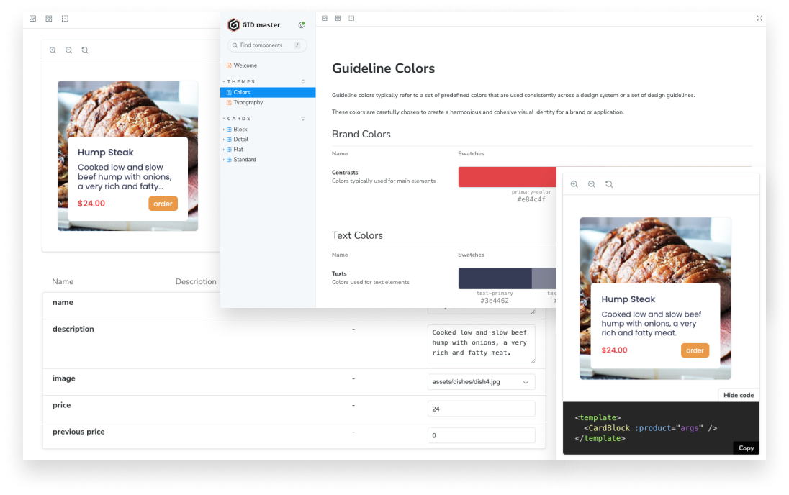

# Restaurant Plugin

This project aims to comprehensively address the entire lifecycle of building a library that can be seamlessly installed as an npm package.

This library offers modular components designed for seamless integration into other projects. It provides comprehensive visual documentation through StoryBook, robust unit tests to safeguard the core code, and streamlines project deployment via GitHub Actions, automating the build and deployment processes to ensure a smooth packaging experience.

## Quick Start

Begin by cloning the repository and installing all the required packages. Once completed, initiate the local server. You'll be able to see all available components.

```
> git clone https://github.com/gidmasterlab/restaurant-app-vite
> npm install
> npm start
```

## Vite Plugin

Vite and package configuration in order to expose components, reusable styles and TypeScript types to be easilly used across other projects.

By leveraging plugin concepts, we can easily separate concerns in modules and keep component-based development to increase productive and make it easier to manage and maintain. Additionally, the shareable structure allows seamless integration across various internal projects, irrespective of version differences.

This project offers a straightforward illustration featuring various card types, a versatile grid container, auxiliary functionalities, and a mock object designed to simulate data.

In real life use, envision a scenario where a company manages multiple e-commerce platforms, employing cards and grids as consistent elements to display their products. Despite this uniformity, each platform may possess a distinct design. This is where the library excels, serving as a centralized repository.

By maintaining these common components in a single library, the company can effortlessly propagate changes across all platforms while utilizing global variables to customize styles based on each platform's unique design requirements.

## Unit Test (Jest)

We can run local tests, but this functionality is also part of the pipeline implemented in the Github actions, we always run the tests before building the artifact.

It makes sure that we haven't broken any component before generating a new package version.

```
> npm run test:unit
```


## StoryBook (Visual Documentation)



All components come with comprehensive visual documentation through a customized StoryBook page. This allows for real-time exploration of component properties, enabling visualization of their behavior in a production-like environment.

Whether running locally or building a deployable version, the documentation remains dynamic and accessible on a server, ensuring an up-to-date resource for users.

```
> npm run storybook
> npm run build-storybook
```

## Github Actions (CI/CD)


### Github Workflow

This file contains the CI/CD pipeline responsible for testing all components, building a production version, and deploying it as a GitHub package. Once the action is successfully completed, you can refer to the repository to learn how to install the package.

```
.github/workflows/npm-publish.yml
```

### Repository Package Page


The repository generates a detailed page outlining the installation process and organizes it by versions, providing a comprehensive guide for users.

```
https://github.com/gidmasterlab/restaurant-app-vite/pkgs/npm/restaurant-app-vite
```

## Install Package

To install a package from an organization's scope, such as @gidmasterlab, you can use the following npm command:

```
> npm install @gidmasterlab/restaurant-app-vite@latest
> npm install @gidmasterlab/restaurant-app-vite@1.0.0
```

This command fetches and installs the specified package from the @gidmasterlab organization scope, just like you would install any other public package.

When consuming a package from a private organization's scope, like @gidmasterlab, you typically need to authenticate with the package registry. To set up the necessary configurations, including authentication, you can use the .npmrc file in the root of your project.

Here's an example of what the .npmrc file might look like:

```
@gidmasterlab:registry=https://npm.pkg.github.com
```

If your GitHub user has access to the organization, setting up a token may not be necessary. However, in cases where access is restricted, an administrator can generate a secure token with read-only access to packages. In such instances, you should include this additional line in your .npmrc file for proper authentication:

```
//npm.pkg.github.com/:_authToken=TOKEN
@gidmasterlab:registry=https://npm.pkg.github.com
```

This ensures that npm can authenticate and access the packages from the GitHub package registry within the specified organization.

## Use Library


### Import Styles

After installing the package, you can import the styles into the main file and customize the global variables to align the package with the project's design.

```
import { createApp } from 'vue'
import App from './App.vue'
import '@gidmasterlab/restaurant-app-vite/style.css';
import './theme.scss';

createApp(App).mount('#app')
```

### Override Styles (Changing Theme)

Within the global styles, we offer a list of variables utilized across all components. This enables you to effortlessly modify colors, margins, and sizes to tailor the design to your project.

To facilitate this customization, introduce a new file named theme.scss and import it immediately after importing the package styles.

```
:root {

	--primary-color: #e84c4f;
	--accent-color: #eda345;

	--text-primary: #3e4462;
	--text-secondary: #8b8fa1;
	--text-light: #ffffff;
	--text-accent: #e84c4f;

	--background-color: #ffffff;
	--divider-color: #ecedf0;
	--screen-margin: 20px;

	--card-height-desktop: 300px;
	--card-height-mobile: 300px;

	--card-width-desktop: 280px;
	--card-width-mobile: 240px;

	--card-gutter-mobile: 20px;
	--card-gutter-desktop: 30px;

	--card-padding: 20px;
	--card-gap: 10px;
	--card-radius: 6px;

}
```

### Adding Components

Bring the component into your local project and integrate it seamlessly. The library exposes mock data to assist you in testing the component effectively.

```
<script setup lang="ts">
	import { GridCards, CardBlock, shuffedData, PRODUCTS_MOCK } from "@gidmasterlab/restaurant-app-vite"
	const products = shuffedData(PRODUCTS_MOCK, 8);
</script>

<template>
  <main>
    <GridCards :quantity="4">
      <CardBlock v-for="product of products" :key="product.id" :product="product" />
    </GridCards>
  </main>
</template>
```

### Global Plugin

ou can also configure the plugin to be globally available in your project, eliminating the need to import the component each time.

Update the main file which serves as the entry point for importing global plugins and mounting the application.

```
import { createApp } from 'vue'
import App from './App.vue'
import RestaurantCardsPlugin from '@gidmasterlab/restaurant-app-vite'

import './styles/index.scss'

const app = createApp(App)
app.use(RestaurantCardsPlugin)
app.mount('#app')
```

Use the global components in your project.

```
<template>
  <main>
    <grid-cards :quantity="4">
      <card-block :product="product" />
    </grid-cards>
  </main>
</template>
```
